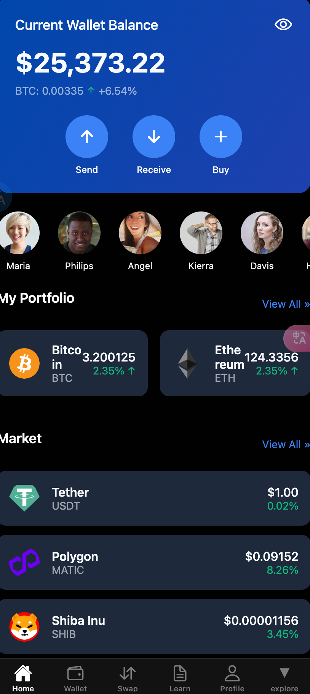
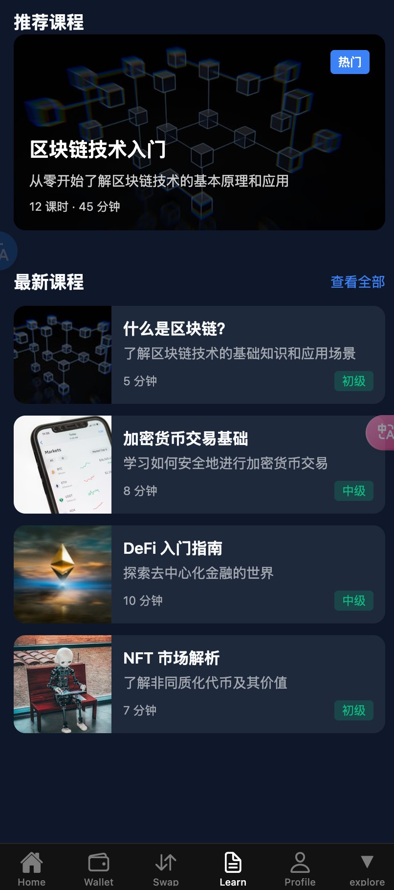

# 🚀 Crypto Wallet App 


供学习ReactNative 使用

<video width="640" height="360" controls>
  <source src="video/1.mp4" type="video/mp4">

</video>

一款现代化、功能丰富的加密货币钱包应用，提供直观的用户界面和全面的加密货币管理功能页面。


## 🛠️ 技术栈

### 前端框架
- **React Native**: 跨平台移动应用开发框架
- **Expo**: 简化React Native开发的工具和服务平台
- **Expo Router**: 基于文件系统的路由解决方案

### UI/UX
- **Styled Components**: CSS-in-JS解决方案，用于组件样式管理
- **Expo Vector Icons**: 丰富的图标库
- **React Native Reanimated**: 高性能动画库
- **Expo Blur**: 实现模糊效果
- **Expo Haptics**: 触觉反馈功能

### 状态管理
- 自定义状态管理解决方案
- 组件间数据共享

## 💻 安装与运行

### 前提条件
- Node.js (v14.0+)
- npm 或 yarn
- Expo CLI

### 安装步骤

1. 克隆仓库
```bash
git clone https://github.com/yourusername/crypto-wallet-app.git
cd crypto-wallet-app
```

2. 安装依赖
```bash
npm install
```

3. 启动应用
```bash
npx expo start
```

## 🔧 技术难点与解决方案

### 1. 实时价格更新
- 实现了高效的数据获取和更新机制
- 优化了UI渲染性能，确保价格变化时界面流畅更新

### 2. 自适应UI设计
- 使用Styled Components实现了主题切换和自适应布局
- 针对不同设备尺寸优化了用户界面

### 3. 性能优化
- 组件懒加载和代码分割
- 使用React Native Reanimated提升动画性能
- 实现了ParallaxScrollView等自定义组件提升用户体验

## 📱 应用截图
| 标题  |                                                                                                                                                                                              图片1                                                                                                                                                                                               |                                                                                                                                                                                              图片2                                                                                                                                                                                               |
| :---: | :----------------------------------------------------------------------------------------------------------------------------------------------------------------------------------------------------------------------------------------------------------------------------------------------------------------------------------------------------------------------------------------------: | :----------------------------------------------------------------------------------------------------------------------------------------------------------------------------------------------------------------------------------------------------------------------------------------------------------------------------------------------------------------------------------------------: |
|       |    |  |
|       |   |


## 🤝 贡献指南


1. Fork 项目
2. 创建功能分支 (`git checkout -b feature/amazing-feature`)
3. 提交更改 (`git commit -m 'Add some amazing feature'`)
4. 推送到分支 (`git push origin feature/amazing-feature`)
5. 创建Pull Request

## 📄 许可证

本项目采用MIT许可证 - 详情请参阅 [LICENSE](LICENSE) 文件

## 📞 联系方式


